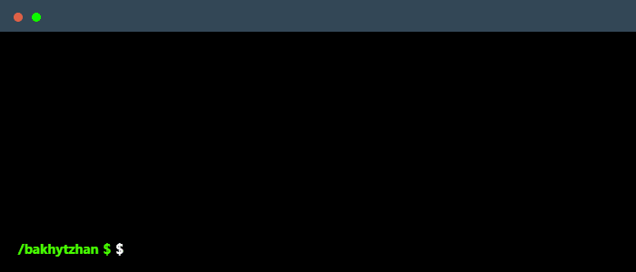

 

    

    

---

### 📌 About Me
🔹 **Backend Developer** working with **Java & Spring Boot**  
🔹 Currently building **Juzzt** – a Spring Boot-based online jazz vinyl store  
🔹 Focused on **clean and scalable architecture, security, and performance**  

---

### ⚙️ **Main Skills**

### 📚 **Currently Learning**

### 🌍 **Connect with Me!**

    
    
    

---

### 📝 **For Employers**
> [!IMPORTANT]  
> <a href="https://drive.google.com/drive/folders/1hJGhQTtzDUzMqRtoIQUx7QTLtCN726ZK?usp=sharing" download>Download my resume</a>

---

